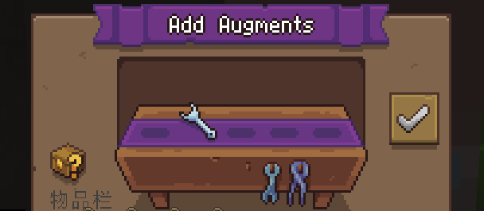

在大部分城镇以及小部分地区，你都可以找到Item Identifier

鉴定师可以帮助你对物品进行鉴定

## 如何鉴定？

找到鉴定师，直接将你希望鉴定的物品摆上去，点击√即可！

鉴定费用将会根据物品等级、物品品质以及重鉴定次数来决定

:::tip 待鉴定的盒子物品实际上在鉴定前就已经确定好了！
这句话要怎么理解呢？

实际上，当你获得未鉴定的物品时，该物品就已经被**内定**是哪件装备了

鉴定的实质其实是对物品的**词条属性**进行随机确定数值，而不是随机确定物品

也就是说，其实玄学的方法并不能改变你获得的是何种装备...

:::

## 进行重鉴定

当你将已鉴定的物品摆至鉴定台时，可以重新进行鉴定

重新鉴定将会对**所有词条**进行再一次的随机更改

每一次重鉴定费用是上一次的**五倍**

重鉴定次数可以在物品介绍下方的品质右侧看到

## 使用鉴定增幅道具

在鉴定时，你可以选择切换至副鉴定屏来添加鉴定道具

每一次只能对一个装备进行附带鉴定增幅道具的鉴定，同时至多应用3个鉴定道具(实际上现在最多只能同时用两个)

鉴定道具效果如下：

### Corkian Amplifier

简称amp

可以提高本次鉴定所有的**正面属性**鉴定值

公式如下：
折算后鉴定值=原始鉴定值+(100%-原始鉴定值)\*amp等级\*5%

换句话说，就是增加了一个保底鉴定值。

原始鉴定值越高，amp效果越小。

需要注意的是，amp不对负面词条起效。

amp的获取途径一般是raid产出。

### Corkian Insulator

在重新鉴定时，可以选择一个指定词条，在本次鉴定中锁定其数值。

与Simulator冲突

在使用的时候你就可以看到GUI了，很好辨别

一般通过lr产出。

>版本更新后发生了多起insulator失效事件，有一定整蛊风险，但正常没有事

### Corkian Simulator

在重新鉴定时，使装备的reroll计数器保持不变。

例如，本次是[2]，则reroll之后还是[2]，并且下一次重新鉴定的价格不变。

与Insulator冲突

未鉴定的装备不能使用simulator

一般通过lr产出

>这玩意比上面的insulator贵多了

