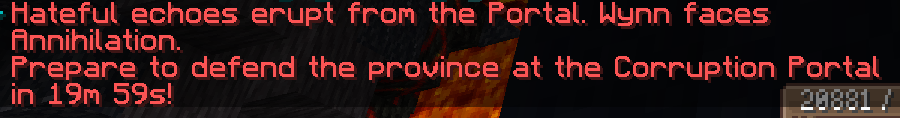

Prelude to Annihilation(下文简称"anni")是一个特殊的世界事件，其每三天发生一次，具体发生的时间点为随机。

>你见过凌晨四点的anni吗

## 介绍

在发生前12小时内，所有玩家都会收到预警，且会在任务书内看到对应的事件。

并且，在聊天框中，所有玩家都会不定期收到消息：

在事件开始前，强烈建议你提前至少1个小时集结或寻找队伍。

Anni允许一个队伍至多10人进行挑战，BOSS的血量会随着队伍**总等级**的增加而上升，单人solo时为32M血量，10人120级的队伍为190M血量。

:::tip 小建议

基本上，大部分时间你都可以在群里组上队。

但介于服务器数量较少，还是比较建议预留较多时间开始组队，避免人数不足导致的翻车。

如果半夜出现anni，可能交流群内难以组上队，这个时候再考虑partyfinder。

请注意，pf质量实际上参差不齐，请注意队长是否有进行buildcheck(装备检查)，否则存在翻车隐患。

:::

### 战斗前

anni作为游戏最终局的战斗，对队伍配置有着相当高的要求。

目前比较不建议非神话玩家进入anni（除了少数武器）

目前常见的队伍配置，一般是需要一个Guardian和若干Halcyon，并且还有其他辅助位和输出位。

对于辅助位，常见的是Ritualist(面具增伤)或者Acolyte(金血，图腾增伤)，Trickster也能提供大量增伤，但不推荐。Guardian本身也能承担辅助位的效果。

对于输出位，推荐以下武器：

+ Apocalypse: 伤害不俗，值得一看
+ Epoch: 打桩强力，能吃多一份melee的消耗品
+ Labyrinth: 大体积好友，比较适合Anni的场地
+ Singularity: 非常高的倍率，伤害可观，但需要暖机是硬伤。
+ Riptide: 伤害不俗，造价低廉
+ Halcyon: 大体积特攻，又能奶又能打，需要提前攒大招进入anni
+ Cataclysm: 伤害可观，但容易被踢死
+ Vengeance: 指定猴戏位，一刀999
+ Olympic: 也算能打，但比以前稍菜
+ Hadal: 造价比其他relik稍低
+ Resonance: 能提供大量金血，本身也能提供可观的伤害

通常在战斗前，队伍需要使用大量的卷轴消耗品，并且dps也建议使用自制药水

对于卷轴，你可以使用下列的检查表来查看缺少的卷轴，比较建议全带上

+ def hp
+ he ele-dmg
+ mr ms
+ spell% raw-spell
+ int spell%
+ rainbow dmg
+ rainbow def
+ str
+ dex

你可以在anni开始前在市场上购买自制消耗品。

在组队伍前，比较建议在anni开始前1-2个小时选择一个人少的新开的服务器，在里面进行组队。

不建议在AS进行组队，AS服务器较少并且质量很差，容易卡顿导致翻车。

关于队伍人数，6人其实已经足够。10人的队伍配置如果有混子将会提高攻克难度。

当anni开始前十分钟，队伍即可前往传送门处集合。目前玩家基本会选择在剩余20-30秒时在倒计时下方使用卷轴消耗品

消耗品配方推荐：

[卷轴——Strength](https://wynnbuilder.github.io//crafter/#4WEWEWEWEWEWEKg00)

[卷轴——Dexterity](https://wynnbuilder.github.io//crafter/#4OGOGOGOGOGOGKg00)

[卷轴——Intelligence & Spell Damage](https://wynnbuilder.github.io//crafter/#44N4N4N4N4N4NKg00)

[卷轴——Defense & HP Bonus](https://wynnbuilder.github.io//crafter/#4yEyEyEyEyEyEKg00)

[卷轴——Agility](https://wynnbuilder.github.io//crafter/#48N8N8N8N8N8NKg00)

[卷轴——Raw Spell Damage](https://wynnbuilder.github.io//crafter/#4iPCqCqiPiPiPKg00)

[卷轴——Mana Regen](https://wynnbuilder.github.io//crafter/#44uCqCq4u4uCqKg00)

[卷轴——Rainbow Damage(二星原料注意)](https://wynnbuilder.github.io//crafter/#4KdCqCqKdKdCqKgW0)

[卷轴——Elemental Damage & Heal Effectiveness](https://wynnbuilder.github.io//crafter/#44nCqCq4n4n4nKg00)

[卷轴——Elemental Defense](https://wynnbuilder.github.io//crafter/#40uCqCq0u0u0uKg00)

[药水——Spell Damage](https://wynnbuilder.github.io/crafter/#4mWCqCqmWmWmWig00)

[药水——Rainbow Damage](https://wynnbuilder.github.io/crafter/#44eCqCq4e4eCqig00)

[药水——HP Bonus](https://wynnbuilder.github.io//crafter/#4aoCqCqaoaoaoig00)

[药水——Defense & Agility](https://wynnbuilder.github.io//crafter/#4aKaKaKaKaKaKig00)

[药水——Mana Regen](https://wynnbuilder.github.io//crafter/#4eyeyeyeyeyeyig00)

[食物——Health Bonus(扣HPR注意)](https://wynnbuilder.github.io//crafter/#4WKWKWKWKWKWK4h00)

[食物——Health Regen(于上述HP食物对冲)](https://wynnbuilder.github.io//crafter/#4KsKsKsKsKsKs4h00)

[食物——True Rainbow Food](https://wynnbuilder.github.io//crafter/#4GoKnKnKnKnKn4h00)

### 战斗中

anni的机制由于目前打的比较快，其实没有什么好讲的，比较需要注意的是两个机制：

激光，anni会在地面发射激光，分为小激光和大激光两类，小激光比较不显眼(虽然有提示纹样)，并且伤害也比较低，在队伍配置足够的情况下基本可以硬吃一发然后无视；大激光在地上会有非常明显的纹样，这个需要躲避，会致死。(虽然现在也基本见不到)

SUN，anni在血量掉至一定阶段时会在头顶召唤SUN，如果不及时打掉会导致团灭，这个技能会有非常明显的title提示，注意不要站在SUN的下方，脆皮会被秒。召唤SUN时会在场地左侧、右侧、后方召唤女巫，女巫会持续为anni回血，但它们是单线程生物，只要过去攻击女巫让他们仇恨转移到攻击者身上，即可停止回血，比较建议法师去清女巫，注意女巫是有点疼的。

除了这两个机制以外，如果队伍中没有Guardian，尽可能靠边站，并小心anni的巴掌，伤害极高。

### 战斗结束

当战斗结束后，在anni面前会刷新宝箱。

内含10-50个le，大量Runes，六级粉和破碎钥匙。

以及其他的一些杂物

最重要的是 Corrupted Caches ，其只有5%的几率掉落，能开出五把黑神话中的随机一把。

