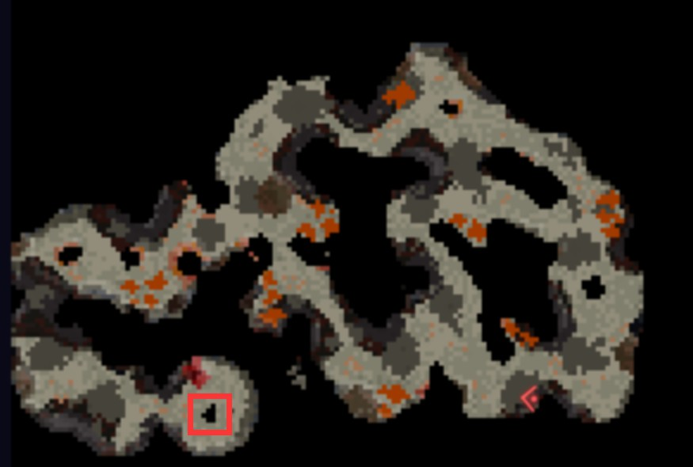

# Lava Spring (level 18)
**熔岩泉**

1.和*Colonel Gailard*`[670 80 -1755]`对话

2.在熔岩泉旁边找到三处腐化的迹象

分别在`[646 77 -1729]`、`[640 73 -1761]`、`[665 76 -1777]`

然后再次与*Colonel Gailard*对话

3.在**Bremminglar**找到*Gregor*`[720 70 -2098]`，对话后跳进井内

4.和药剂师`[652 6 -2075]`对话，拿到耐热药水后回去找*Colonel Gailard*

5.进入旁边的洞(记得喝药水)

洞内地图如下：

击破岩浆之心即可

6.继续和*Colonel Gailard*对话

奖励
+ 4000 经验值 
+ 192 绿宝石
+ 可以进入Bremminglar的药水商店了

>小趣事：不喝药水直接进洞会被烫到起飞