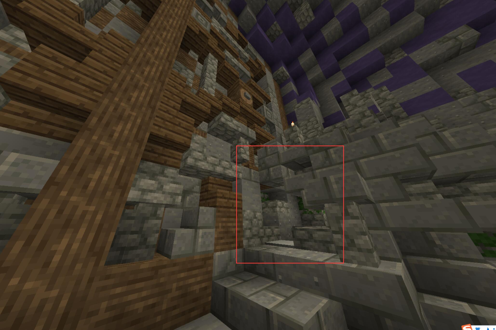

# WynnExcavation Site B (level 46)
**Wynn考古集团 地点B**

前置任务：[WynnExcavation Site A](/quests/lvl41-50/level%2046%20-%20wynnexcavation%20site%20b.html)

:::warning
记得带好前置任务给的黄色水晶
:::

1. 从`[32, 76, -489]`的洞穴下去，和**Excavator Lykron**对话,并给予一个Wynn Excavation Site A任务得到的黄色水晶。

2. 到洞穴的深处，和**Flendar**说话，跳入旁边的水池

3. 通道走到底，解决难题，然后进门，继续沿着洞走到底

:::tip
只要会做三视图就能做这个

注意旁边有方块数量限制

:::

4. 进入**Excavation Archaeologist**后面大门旁边的小洞

5. 收集Purple Crystal Shard ，然后通过洞穴传送回去。.

6. 把紫色水晶Purple Crystal Shard交给**Excavator Lykron**

奖励
+ 50000 经验值
+ 1536 绿宝石
+ 1 Purple Crystal Shards (quest item)
