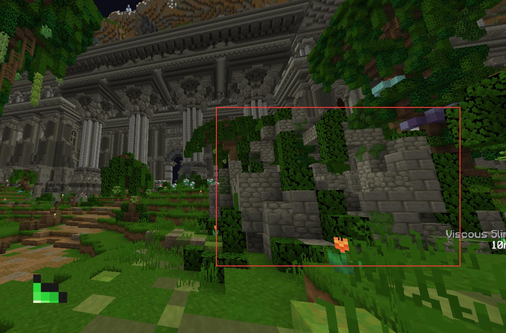
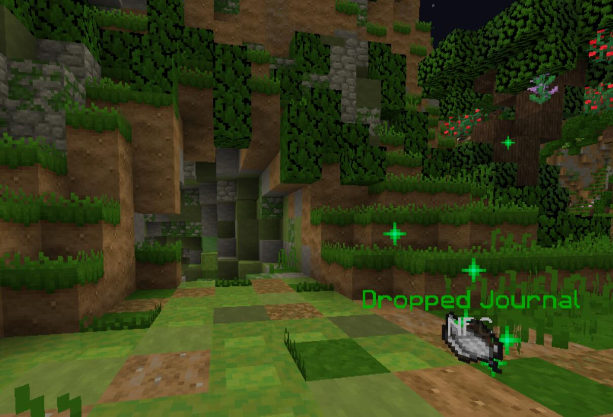

# Corrupted Betrayal (level 52)
**恶堕的复仇**

:::tip 重要任务
Undergrowth Ruins 副本前置任务
:::

1.和**Troms Mage**`[-641 59 -872]`对话，触发剧情

2.解决法师给你的难题

:::tip
你可以在`[-539 64 -675]`的废墟内找到一只奇怪的羊

进去后，通过按钮按开大门，在时限内将羊带到`[-656 61 -668]`的洞内，下到洞的最深处即可

:::

3.探索地下隧道(走到最里面触发剧情即可)

4.前往Slykaar的据点`[-727 61 -942]`，和房间内的Old journal交互后，按下红石粉所指暗门右边的按钮，然后跳下洞口

5.击杀史莱姆提交来建造继续前进的桥，随后跟着隐藏的桥梁走，最后通过一小段史莱姆跑酷

6.回去找**Troms Mage**交差

奖励
+ 87725 经验值
+ 1024 绿宝石
+ 1 Undergrowth Ruins Key
+ 可以进入 Undergrowth Ruins 副本了