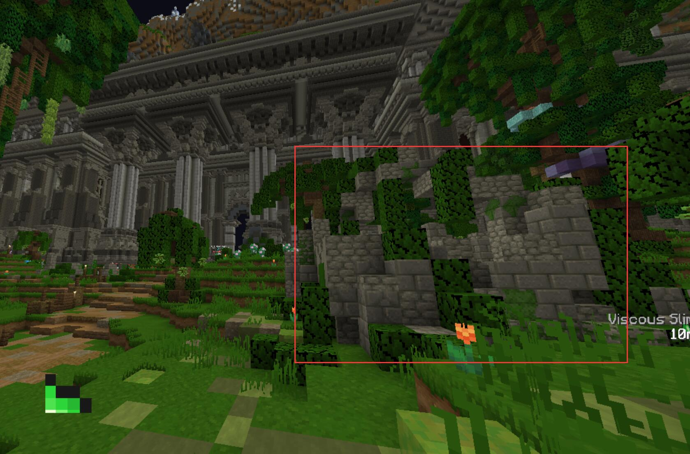
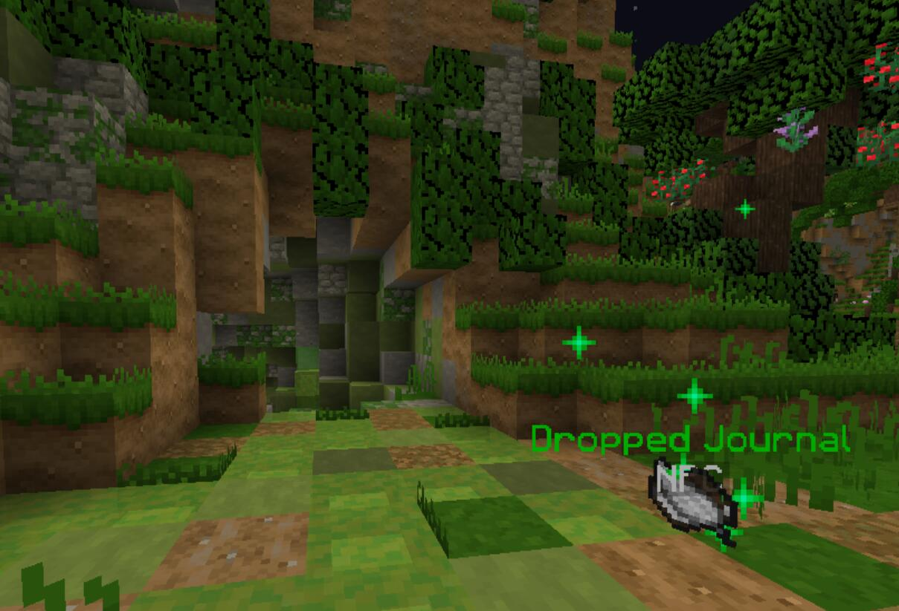

## 任务信息 / Information
任务等级：Level 52 / 推荐等级： Level 52
任务时长：长 / 任务难度：中等
中文译名：堕落之叛

:::tip 重要任务
Undergrowth Ruins 副本前置任务
:::

:::tip Troms要怎么过去？

从如图所示的路径过去即可

注意：图上的路径会经过一座桥(The Great Bridge)，桥上怪物伤害较高，建议骑马或者直接用技能冲过去
:::

## 奖励清单 / Rewards
+ 87725 经验值
+ 1024 绿宝石
+ 1 `Undergrowth Ruins Dungeon Key`
+ 1 `Slykaar's Heart`

### Step 1 接取任务
---
前往 <CC>-628 74 -868</CC> 处与 <NPC>Lanu</NPC> 对话。他告诉你这个旧堡垒正在不断涌出史莱姆，这给 Troms 带来了很大麻烦。你需要去调查旁边的墙上刻着的古代谜语，右键点击墙壁阅读谜语。

### Step 2 解开谜语
---
根据谜语的提示，找到它所指示的地点并进入古老废墟。

:::tip 谜语解法
你可以在 <CC>-539 64 -675</CC> 的废墟内找到一只奇怪的羊（颜色为青柠色，对应谜语的 color of lime）。

进去后，羊的仇恨会锁定在你的身上。
通过按钮按开大门，在时限内沿着小路将羊带到 <CC>-656 61 -668</CC> 的洞内（对应 heading to the slime），下到洞的最深处即可。

:::

### Step 3 探索神庙
---
在神庙中探索，寻找打破屏障的方法。
- 进入位于 <CC>-1668 49 602</CC> 的房间，这会激活机器并生成一只 <mob>Mutated Slime Monster</mob>。击杀它以获取  `Basement Storage Key`。
- 将钥匙右键点击门锁以打开大门继续前进。
- 在地上 <CC>-1690 49 604</CC> 处找到一封奇怪的邀请函 `Strange Invitation`，上面写着国王赐予的住所坐标位于 <CC>-727 61 -942</CC>。

### Step 4 前往旧居
---
前往位于 <CC>-732 65 -974</CC> 附近的 Slykaar 住所。
在 <CC>-721 50 -965</CC> 的书架上找到并阅读一本旧日记（journal），了解到他为了复仇在此开辟了隐藏维度。
随后找到隐藏的房间，Slykaar 的虚影会出现并敲击他的圣物（Relik），接着进入他的异维度。

### Step 5 穿越异维度
---
在 Slykaar 的异维度中穿行，见证他的阴谋。
- 击杀 <mob>Solidified Slime</mob> 收集 25 个 `Slime Glob`，用于建造通往下一个岛屿的桥梁。
- 通过一个隐形迷宫，当你靠近时，正确的路径才会显现出来。
- 完成一段史莱姆方块跑酷。注意带有紫色的史莱姆平台会让你弹得更高。
- 继续沿着道路走到祭坛，触发 Slykaar 的最后一段对话，随后离开这个异维度。

### Step 6 回报发现
---
回到 <CC>-628 74 -868</CC> 找 <NPC>Lanu</NPC>，向他汇报你所了解到的一切关于 Slykaar 的维度以及他企图报复 Troms 的阴谋。

## 剧情省流 / Summary
Troms 正面临着附近 Undergrowth Ruins 不断涌出的史莱姆的威胁。Lanu 请求冒险者帮忙调查这个遗迹的根源，并让冒险者查看墙上的一段神秘谜语。

冒险者解开谜语后掉入了一个古老的废墟。在废墟中，冒险者发现了一些实验笔记，揭开了过去的秘密：当年 Troms 遭到亡灵大军攻击时，国王曾向萨满 Slykaar 求助。Slykaar 通过黑暗魔法和活人献祭保护了城市，但也借此控制了 Troms。直到英雄 Bob 出现，Troms 的人民立刻抛弃了手段残忍的 Slykaar。

感到屈辱和愤怒的 Slykaar 潜入地下，开始进行恶魔般的实验。他试图将动物和亡灵融合，最终创造出了这些可怕的史莱姆怪物，并发现了一种更黑暗、更强大的力量。

冒险者在废墟中找到了一封前往 Slykaar 旧居的邀请函。在旧居的隐藏房间里，冒险者进入了 Slykaar 创造的异维度。Slykaar 现身并嘲讽了冒险者，他表示当年国王为了自保心甘情愿牺牲平民，而自己作为保护者却像烂水果一样被抛弃。他声称自己已经获得了更强大的黑暗力量，很快就会让 Troms 化为废墟以完成复仇。

冒险者离开异维度并向 Lanu 汇报了这一切。Lanu 意识到 Slykaar 的力量正在不断增强，甚至能产生幻象。如果不加以阻止，Troms 将面临灭顶之灾。他嘱咐冒险者做好准备，集结伙伴，前往洞穴彻底终结这个堕落的萨满。