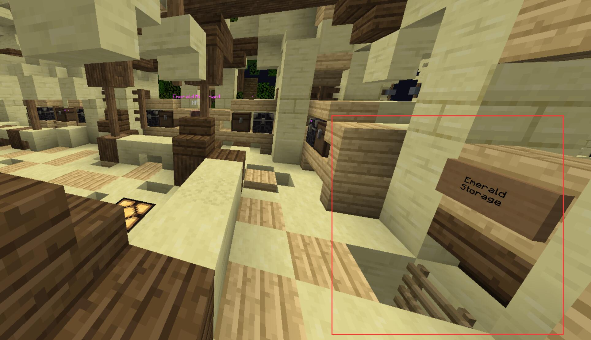
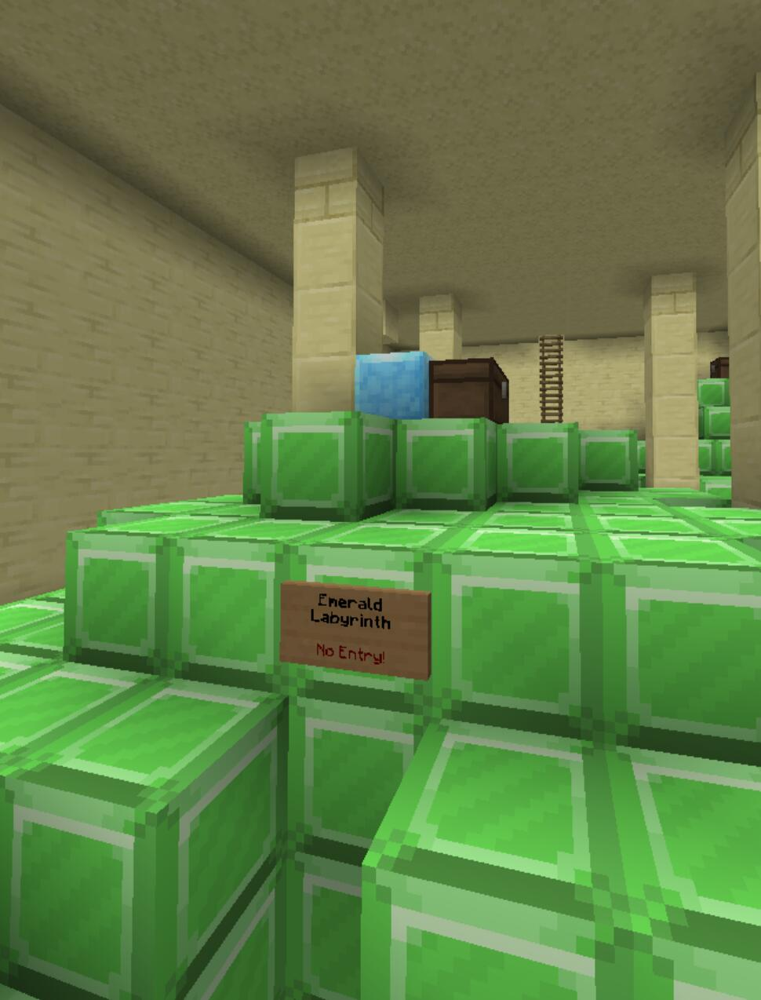
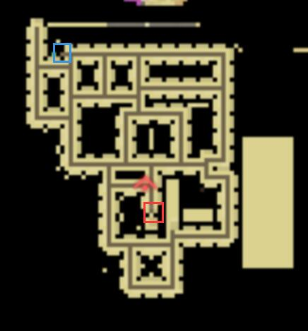

## 任务信息 / Information
任务等级：Level 52 / 推荐等级：Level 52
任务时长：长 / 任务难度：困难
前置任务：A Sandy Scandal
中文译名：丛林热

:::tip Troms要怎么过去？

从如图所示的路径过去即可。
注意：图上的路径会经过一座桥 (The Great Bridge)，桥上会经历一场BOSS战，有点难度。
:::

## 奖励清单 / Rewards
+ 86250 经验值
+ 4096 绿宝石
+ 1个 `Undergrowth Ruins Key`

### Step 1 探望病人
---
和位于 Iboju Village 的 <NPC>Worid</NPC> 交谈，坐标 <CC>-739 80 -661</CC>。

### Step 2 寻求“解药”
---
前往 Detlas，和 <NPC>Detlas's Banker</NPC> 交谈，坐标 <CC>497 67 -1559</CC>。

### Step 3 潜入金库
---
进入 Detlas 的地下金库 Detlas' Emerald Stash (就在银行家旁边的铁门)，入口坐标为 <CC>494 67 -1553</CC>。

### Step 4 银行会合
---
在 Detlas 银行地下的金库内与 <NPC>Worid</NPC> 会合并交谈。

### Step 5 勇闯迷宫
---
潜入地下 Almuj's Emerald Labyrinth（入口坐标 <CC>1019 84 -1976</CC>），穿越重重守卫找到 <NPC>Almuj Banker</NPC> 与他交谈。

> 在蓝圈的压力板放任意物品后，红圈的门将会打开。

:::tip
迷宫内的守卫 <mob>Emerald Golem</mob> 攻击和血量都极高，小心不要被打到，最好一气呵成。
:::

### Step 6 交付财物
---
前往 Almuj 市场附近与 <NPC>Worid</NPC> 交谈，坐标 <CC>956 75 -1960</CC>。

:::tip
最终任务给予你的液态绿宝石并不能当真钱使。
:::

## 剧情省流 / Summary
在丛林村庄里，Worid 咳个不停，声称自己感染了非常严重的“丛林热”。他告诉冒险者，唯一能治愈这种发烧的解药就是喝下整整 64 个液态绿宝石。他请求冒险者去向 Detlas 的银行家讨要这些钱，如果银行家拒绝，就直接动用武力闯入绿宝石仓库，并叮嘱冒险者千万别自己拿走任何东西。

冒险者来到 Detlas 找到了银行家。银行家听后大发雷霆，直言这完全是个骗局，液态绿宝石除了能治穷病之外根本治不了任何病，并果断拒绝参与这场可悲的诈骗。

为了拿到所谓的“解药”，冒险者只好潜入 Detlas 的秘密金库，却惊愕地发现 Worid 已经安然无恙地站在里面了。Worid 随口敷衍了自己装病的尴尬，表示刚才只是为了测试冒险者潜入银行的能力。接着他露出了真面目，指派冒险者去突袭 Almuj 那个由守卫魔像重重把守的“绿宝石迷宫”，因为那里的银行家肯定无聊透顶，不会介意被人找上门。

冒险者历经艰险穿越了充满致命守卫的地下迷宫，终于在最深处的绿宝石房间找到了 Almuj 的银行家。正如 Worid 所料，这位银行家因为太久没见到活人而激动万分，极其爽快地将大量的液态绿宝石白白送给了冒险者。

冒险者带着巨款回到 Almuj 市场找到了 Worid。Worid 看到这么多钱激动不已，终于“有钱治病”了。然而他并没有把绿宝石分给冒险者，而是拿出一把部落首领用来封印邪恶力量的钥匙作为报酬交给了冒险者，随后心虚地祝冒险者好运便溜之大吉。