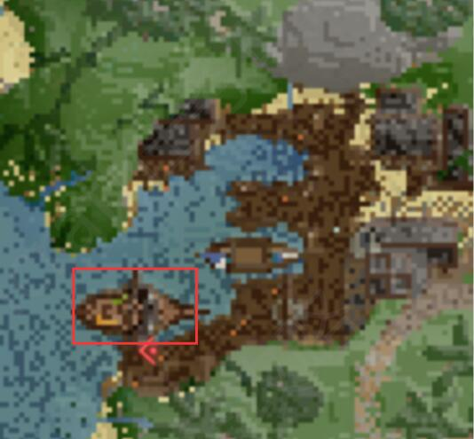

# Redbeard's Booty (level 61)
**红胡子的宝藏**
:::tip 重要任务
解锁Galleon’s Graveyard副本
:::
1 跟*Marston*在`[-608 40 -3546]`谈话
>(在**Galleon's Graveyard**，海盗湾和Selchar可以坐船去)

2 和Marston’s Crew`[-659 43 -3154]`对话(抵达海盗湾后右边第一座屋子)

3 在海盗湾码头坐船出发(下图红圈处的船)

4 找到宝藏,到一片海域之后有三小块陆地,靠近可以传送,需要找到三个地图碎片

第一块陆地是解密,将水引入(如图)。

第二块陆地是杀怪得到掉落物,扔入漏斗(每个漏斗2掉落物)

第三块陆地是跑酷到山顶。

5 集齐三个碎片后你会获得一个带标记的藏宝图(在上一步要求杀怪的岛)，到达那个位置之后会传送到一个岛屿，触发剧情后你需要在`[90 44 -15210]`的山洞获得3根线,在`[80 39 -15255]`的树下获得4个压力板,然后修复船只触发剧情

6 回去和*Marston*`[-608 40 -3546]`交任务

奖励
+ 180000 经验
+ 1 Galleon’s Graveyard Key
+ 可以进入 Galleon’s Graveyard 副本了

:::tip
Marston给你的鱼可以跟海盗湾的金鱼商人交易。
:::
