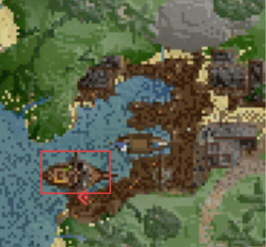
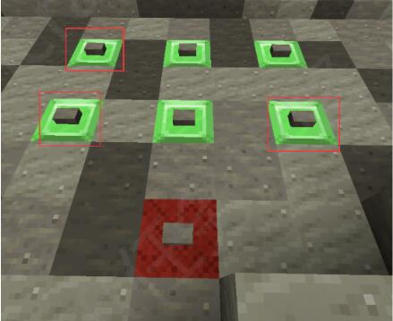

## 任务信息 / Information
任务等级：Level 61 / 推荐等级：Level 61
任务时长：长 / 任务难度：困难
中文译名：红胡子的宝藏

:::tip 重要任务
解锁 Galleon’s Graveyard (帆船葬场) 副本
:::

## 奖励清单 / Rewards
+ 180000 经验值
+ 1个 `Galleon's Graveyard Key`
+ 1条 `Golden Pirate Fish`
+ 1根 `Redbeard's Hair`

:::tip
任务奖励的 `Golden Pirate Fish` 可以卖给 Pirate Cove 的金鱼商人 (Golden Fish Merchant) 换取钱财。
:::

### Step 1 寻找红胡子的宝藏
---
在海洋中（Galleon's Graveyard 副本外围），与 <NPC>Marston</NPC> 交谈，坐标为 <CC>-570 40 -3543</CC>。

### Step 2 与船员会合
---
前往 Pirate Cove（海盗湾），在坐标 <CC>-659 43 -3154</CC> 找到并与 <NPC>Marston's crew</NPC> （抵达海盗湾后右边第一座屋子）对话。

### Step 3 登船出发
---
前往 Pirate Cove 的码头，登上名为 Black Ring 的海盗船，坐标为 <CC>-710 36 -3142</CC>（下图红圈处的船）。

### Step 4 搜集地图碎片
---
航行到一片海域后，你会看到左、中、右三座岛屿。你需要分别前往这三座岛屿，完成挑战以获取三个地图碎片：

**左侧岛屿**（入口坐标 <CC>8705 11 6886</CC>）：
需要躲避落石并完成一段跑酷爬到山顶。在最顶端 <CC>-7866 131 -3488</CC> 处，有一个红色的“X”标记，按下中间的按钮获得碎片。

**中间岛屿**（入口坐标 <CC>8742 12 6920</CC>）：
直接进入出生点附近的水下洞穴进行解密（将水引入如图）。按顺序按下按钮 2、5 和 6 即可解开谜题，随后会打开一扇门。进入小房间，在红色“X”处按下按钮获得碎片。

**右侧岛屿**（入口坐标 <CC>8703 11 6939</CC>）：
这是一个杀怪挑战。首先击杀成群的怪物获取 `Magical Thunder Shard`，使用两个碎片在场地周围的水晶下方召唤出小 Boss <mob>Summoned Beast</mob>。击杀全部三个 Boss 后，将它们掉落的 `Essence of the Beast` 投入坐标 <CC>-7916 64 -3806</CC> 出现的漏斗中即可获得地图碎片。

### Step 5 寻找隐藏岛屿
---
集齐三个碎片后，它们会自动拼成一张带有标记的 `Treasure Map`。

返回**右侧的岛屿**（刚刚打怪的岛），向左转沿着新地图上的路径爬到岛屿顶部。在坐标 <CC>-7918 112 -3756</CC> 处进入一个传送门，你会被传送到一个隐藏的岛屿。抵达后触发剧情，船员们会开始挖宝。

### Step 6 逃出生天
---
在剧情中，船员们发现宝藏只是一堆钥匙，恼羞成怒之下将你打晕并抛弃在岛上。

醒来后，在红色“X”标记的中间捡起地上的 `Ancient Key`。随后你需要收集材料，前往坐标 <CC>25 38 -15260</CC> 修复一艘破船以逃离荒岛：
- 在坐标 <CC>90 45 -15210</CC> 的山洞中收集 3 根线 (`String`)。
- 在坐标 <CC>80 39 -15255</CC> 的树下收集 4 个木板 (`Wood Planks`)。

### Step 7 揭露背叛
---
逃出荒岛后，带着你在任务中获得的两张地图，回到坐标 <CC>-570 40 -3543</CC> 处与 <NPC>Marston</NPC> 交谈交差。

:::tip
在与 Marston 交谈时，请确保你的背包里同时带有任务中获取的**两张地图**，否则他无法正常触发对话。如果第一张地图丢失，任务将无法完成。

你从隐藏岛屿带出来的 `Ancient Key`，可以扔进 <CC>-602 40 -3544</CC> 处的漏斗中，以开启 Galleon's Graveyard 副本的入口。
:::

## 剧情省流 / Summary
Marston 船长热情地邀请冒险者加入他的寻宝队伍，一起去寻找传说中红胡子的沉船宝藏。他让冒险者先去海盗湾的据点与他的船员们会合。

冒险者在海盗湾找到了船员 Martim、Argus 和 Karkun。由于 Marston 迟迟未到，急躁的船员们决定抛下船长，带着买来的藏宝图直接扬帆起航。船只抵达了一片神秘的群岛，船员们指使冒险者去探索三座岛屿搜寻线索。冒险者历经艰险，完成了惊险的山峰跑酷、解开了水下洞穴的机关，并击败了召唤出的魔法野兽，成功集齐了三块地图碎片。

碎片拼凑成了一张新地图，指引众人来到了一个受魔法隐藏的岛屿。船员们兴奋地挖开标记地点，却绝望地发现里面根本没有金币，只有一堆古老的钥匙和一条解谜线索。恼羞成怒的船员们决定背叛冒险者，将冒险者打晕丢在荒岛上，企图自己去解开秘密并复活红胡子，成为他麾下的新海盗。

冒险者醒来后，捡起了海盗们遗落的一把古老钥匙。通过在岛上山洞里收集绳线、在树下收集木板，冒险者成功修好了一艘破损的小船，顺利逃离了荒岛。

回到最初的海域，冒险者与同样被船员暗算抛弃的 Marston 船长重逢。Marston 听闻了船员们的背叛行径后怒不可遏，他把身上仅有的一条珍贵金鱼送给了冒险者作为补偿，并鼓励冒险者拿着那把古老的钥匙追进帆船葬场，去亲手夺回那份本该属于冒险者的真正宝藏。