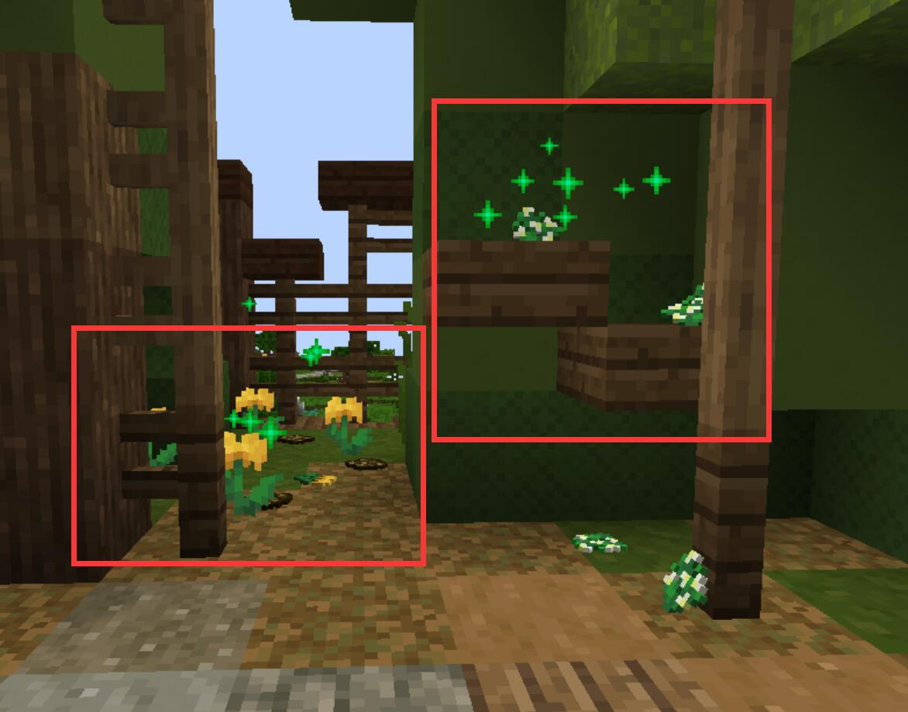
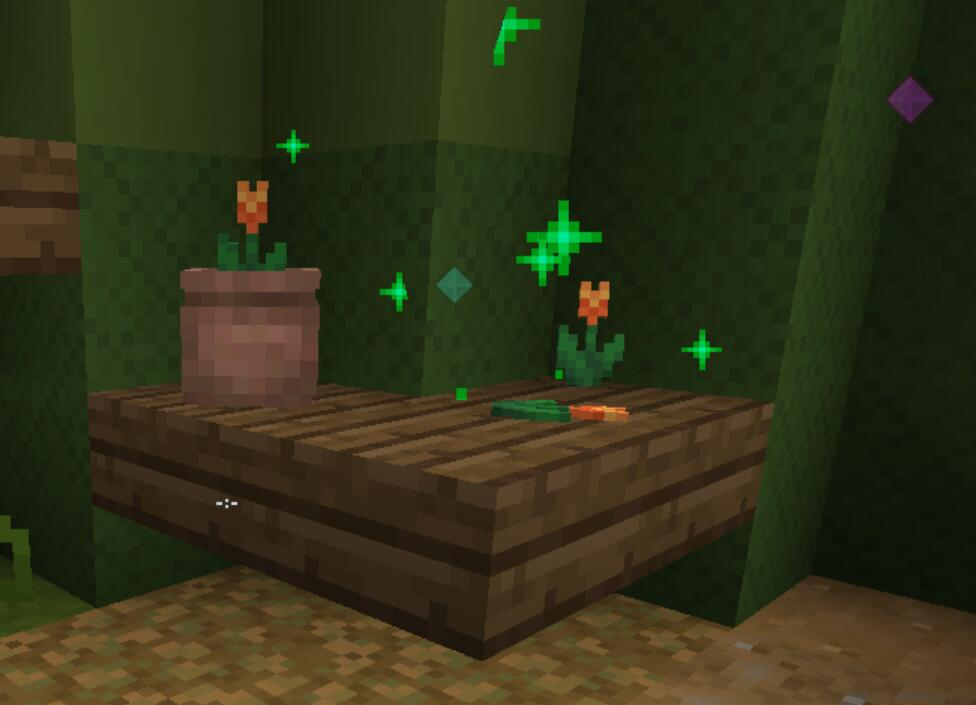

## 任务信息 / Information
任务等级：Level 64 / 推荐等级： Level 64
任务时长：长 / 任务难度：困难
中文译名：和平之路
前置任务：
+ [Clearing the Camps (level 39)](/quests/lvl31-40/level%2039%20-%20clearing%20the%20camps.html)
+ [Blazing Retribution (level 44)](/quests/lvl41-50/level%2044%20-%20blazing%20retribution.html)
+ [Reclaiming the House (level 61)](/quests/lvl61-70/level%2061%20-%20reclaiming%20the%20house.html)

:::tip
在进行此任务前，你可以提前准备好一些材料以快速完成兽人要塞内的小任务（如5个 `Carpfish meat`，5个 `Iron Ingot`，6个 `Willow Planks` 等，详见 Step 7），这能为你节省大量跑图的时间。
:::

## 奖励清单 / Rewards
+ 350000 经验值
+ 3072 绿宝石
+ Upgraded Orc Mask (面罩)

### Step 1 接取任务
---
和 **Bucie** 大门前的 <NPC>Captain Goruca</NPC> <CC>-1392 43 -4699</CC> 对话。他告诉你，派去谈判的外交小队被兽人的投石机击退了。

### Step 2 了解情况
---
跟着 <NPC>Captain Goruca</NPC> 来到伤兵连的医疗帐篷 <CC>-1421 43 -4688</CC> 听取简报。队长要求你亲自前往兽人要塞，带回停战协议，或者带回兽人老大的头颅。

### Step 3 前往要塞
---
前往兽人要塞入口 <CC>-1310 59 -4866</CC>。你刚踏入就被兽人守卫击倒，但随后被一个叫 <NPC>Zuett</NPC> 的兽人救起。他表示并非所有兽人都崇尚暴力，并要求你通过和平狩猎来证明你的诚意。

### Step 4 狩猎试炼
---
前往狩猎场 <CC>-1348 43 -4956</CC>，为了 <NPC>Zuett</NPC> 的求和建议进行打猎。
:::tip
死跟着头上有粒子的猪，到它躲进的灌木丛右键一下就可以了。
重复猜对三次该步骤后，<mob>Elite Boar</mob> 会现身。击败它以获取 `Elite Boar Meat`。
:::

### Step 5 突发意外
---
拿着刚刚打猎得到的猪肉去和 <NPC>Zuett</NPC> <CC>-1310 44 -4915</CC> 对话，然后再次跟着他来到兽人要塞中心。此时，兽人营地的大炮发生意外炸膛，导致唯一在场的医生 <NPC>Ressinter</NPC> 身受重伤。

### Step 6 治疗伤兵
---
你被带到了兽人医疗帐篷里，被要求利用草药学知识帮忙稳住伤情。
:::tip
拿以下三种花放在药草槽内：
Sweetgale，Chamomile，以及 **两个** Yarrow。

按照兽人医药书的记载混合药膏后即可成功保住他的性命。
:::

### Step 7 获取信任
---
虽然你救了兽人，但守卫 <NPC>Ureietun</NPC> 仍然对你保持警惕。你需要在兽人要塞 <CC>-1310 61 -4816</CC> 内帮助其他兽人以获取信任。

:::tip
以下NPC的小任务你只需要**挑四个**完成就可以了。每做完一个都会有一点绿宝石或材料奖励。注意：即使已经完成了4个，继续完成仍然会有小奖励。加粗的是比较推荐做的，速度最快。

+ **<NPC>Peloros</NPC> <CC>-1318 62 -4820</CC>:**
在25秒内跑到粉色信标所指的绿塔顶部将货物交付给 <NPC>Fruludir</NPC>。记得回去找 <NPC>Peloros</NPC> 交任务！

+ **<NPC>Xoeinbor</NPC> <CC>-1289 64 -4794</CC>:**
必须要选第三个选项（"Xoeinbor."），其他选啥都会被骂。

+ <NPC>Durbeo</NPC> <CC>-1288 62 -4783</CC>:
在附近的河采集 `Carp Meat`，基础要求是5个，但上限是30个（奖励最丰厚）。注意你需要达到钓鱼等级Lv.30才能完成这个小任务。

+ **<NPC>Yunelsu</NPC> <CC>-1297 62 -4837</CC>:**
一直对旁边的石头释放你的法术技能，连续施放4次直到剧情结束为止。

+ <NPC>Lomoster</NPC> <CC>-1344 69 -4835</CC>:
去东边的山谷或 **Karoc Quarry** 采集5个 `Iron Ingot`。注意你需要达到对应的采矿等级才能完成。

+ <NPC>Creinu</NPC> <CC>-1302 70 -4770</CC>:
在他附近击杀 <mob>Feyborne Alraunes</mob>，收集3个 `Leafy Stalks` 交给他就可以了。

+ <NPC>Onluk</NPC> <CC>-1336 71 -4813</CC>:
去附近（例如 Olux Swamp）采集6个 `Willow Planks`（柳木板）交给他，然后前往小山丘上的塔楼与他会合。

+ **<NPC>Miliyus</NPC> <CC>-1301 49 -4835</CC>:**
去 <CC>-1302 46 -4693</CC> 瀑布旁的洞内找到8个 `Terramarine Buds` 交给他。

+ **<NPC>Kreimu</NPC> <CC>-1378 69 -4836</CC>:**
回答药理学问题。按以下顺序选择选项（从第一个选项开始计算）：
1 1 3 2 3

+ <NPC>Etemitoro</NPC> <CC>-1318 49 -4824</CC>:
去 <CC>-1231 102 -4799</CC> 给他带回一个 `Leaden Stone`。

+ <NPC>Nunexetor</NPC> <CC>-1293 49 -4821</CC>
跟小兽人玩一个捉迷藏游戏，分别藏在以下地点：
Mango <CC>-1288 83 -4780</CC>
Blueberry <CC>-1292 62 -4845</CC>
Grapes <CC>-1295 75 -4802</CC>
Peaches <CC>-1320 53 -4799</CC>
全部找到后回去找 <NPC>Nunexetor</NPC> 交差。

+ <NPC>Teiren</NPC> <CC>-1321 62 -4837</CC>:
去东南方向的旧营地 <CC>-1268 47 -4723</CC>，击杀争夺物品的怪物，将掉落的 `Odd-Shaped Item` 带回给他。
:::

### Step 8 觐见首领
---
获取信任后，找到 <NPC>Ureietun</NPC> <CC>-1276 62 -4832</CC>，她终于同意让你进入首领营帐与 <NPC>Arrai-Veretel</NPC> 见面。

### Step 9 激烈谈判
---
跟随 <NPC>Arrai-Veretel</NPC> 进入地下室的会议室 <CC>-1260 55 -4837</CC> 并听取剧情。

### Step 10 仪式对决
---
为了证明和平的价值，进入会议室下方的竞技场，击败首领 <mob>Arrai-Veretel</mob>。
> 提示：她分为两个阶段，第二阶段会频繁使用拉扯和爆炸法术，注意保持走位。

### Step 11 交付协议
---
战斗与剧情结束后，带着兽人签署的停战协议返回 **Bucie**，交还给 <NPC>Captain Goruca</NPC> <CC>-1392 43 -4699</CC>。

## 剧情省流 / Summary
Goruca队长告诉冒险者，前去谈判的外交小队遭到了兽人投石机的袭击。他命令冒险者潜入兽人要塞，带回停战协议或是兽人首领的人头。

冒险者刚踏入要塞便被守卫击倒，但被一名叫Zuett的兽人救下。Zuett不愿看到战火延续，他让冒险者去狩猎一头精英野猪，以此证明人类不仅会杀戮，也能通过行动展现诚意。冒险者带着猎物返回时，营地内的大炮意外炸膛，导致兽人医生Ressinter身受重伤。冒险者果断利用草药知识为其急救，成功保住了他的性命，赢得了众多兽人的尊重。

为了获得面见女酋长的资格，冒险者在营地内四处奔波，帮助兽人们解决各种难题。守卫Ureietun终于被打动，放行冒险者进入首领的营帐。然而，女酋长Arrai-Veretel一眼认出，冒险者正是此前摧毁兽人营地、击杀兽人Rai-Poxper的罪魁祸首。她愤怒地指出人类的虚伪：村民们早已违背了最初的停战协议，破坏了兽人的土地，兽人攻占人类堡垒仅仅是为了自卫。

Zuett出面为冒险者辩护，认为冒险者曾受村民蒙骗，但如今真心渴望弥补过错。Arrai-Veretel虽然心存疑虑，但同样渴望终结无休止的流血冲突。她要求冒险者在竞技场中进行一场神圣的仪式对决，用实力证明和平的决心。

经过激烈的战斗，冒险者击败了Arrai-Veretel却未下杀手。女酋长心服口服，正式签署了停战协议。她承诺兽人不会再主动攻击城市，但也警告说，村民的行为已经导致东北方的土地腐化，如果人类继续侵犯，兽人仍会奋起反击。冒险者带着协议返回营地，为这片平原带来了一丝久违的和平。