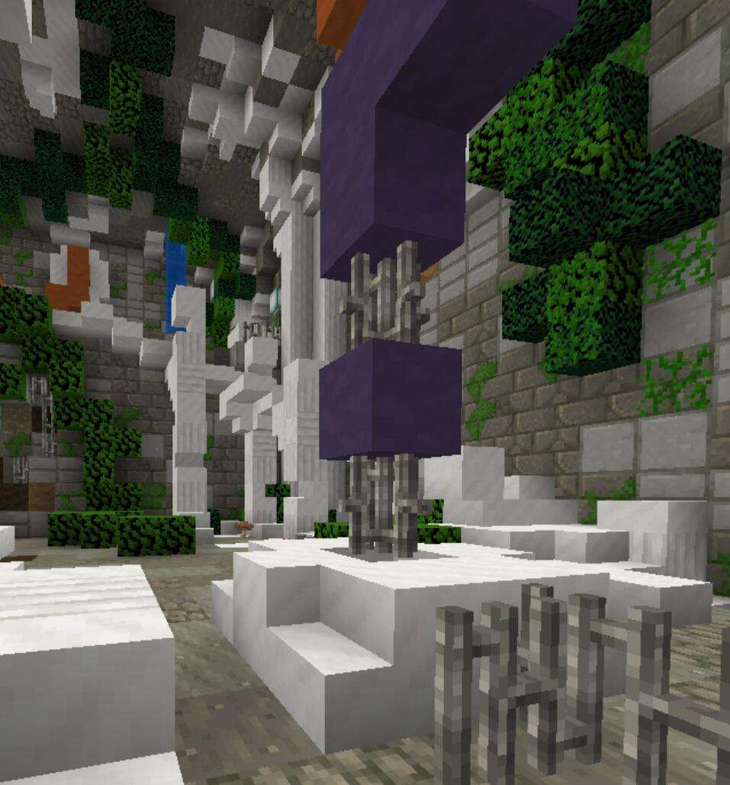
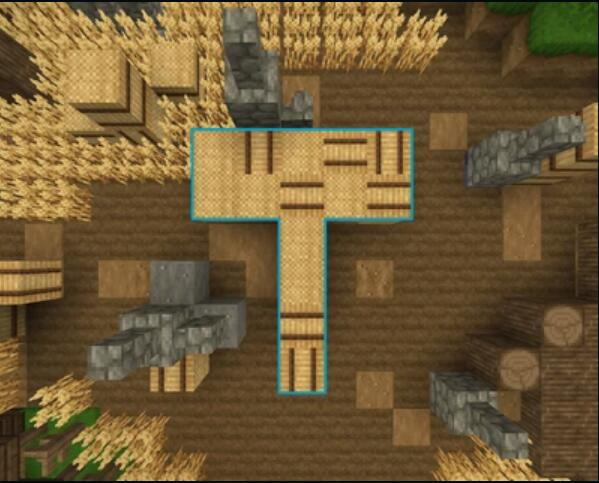
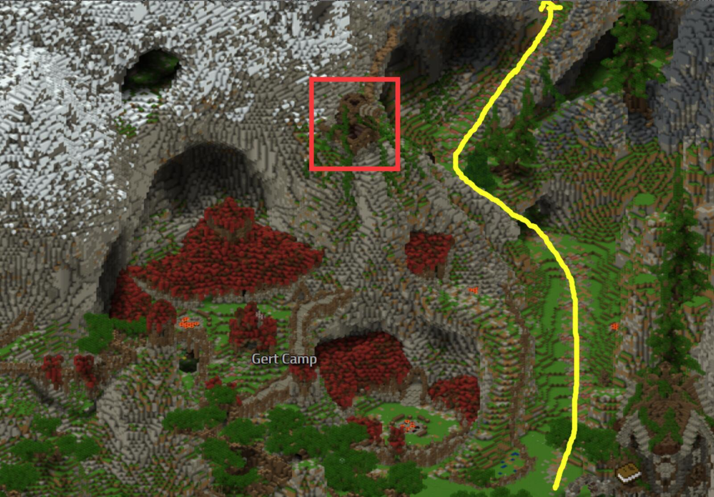
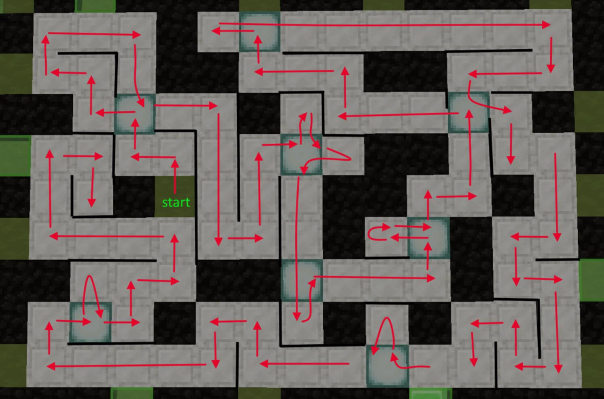

# ??? (level ???)
**来自疯狂科学家的解密挑战**

:::warning
本任务为多人合作解密任务，任务途中在游戏内全程没有任何提示
:::

在开始流程前，先去准备好这三样东西

[Memory Paranoia](lvl61-70.html#memory-paranoia-level-67)中在儿子射壁炉的场景拿到汤勺

[The Bigger Picture](/quests/lvl71-80.html#the-bigger-picture-level-76)中先去洞穴入口`[-172 46 -4395]`缩小自己后，再去`[-305 91 -7705]`拿到Tiny Mushroom

然后要去Skien Island拿到一幅画`[388 87 -3529]`

只要有任意玩家准备好这三样东西就行了

你可以多屯点，以后就不用再跑一趟去拿了

### ??? - 阶段一
**这个阶段需要三名玩家**

三名玩家需要分别前往红黄蓝三个陨石点，完成解密后一起站在指定位置，方可传送至接取任务的地方

**蓝色陨石**

前往**Aldorei Valley Outskirts**`[-754 102 -4416]`

打死下图的NPC，拿到一个锄头，当拿着锄头时，玩家可以推动田间的干草捆

将干草堆推动成如下的形状

完成后会出现一个限时跑酷，通过跑酷可以来到瀑布上，此时一面墙会破开，进去即可

如果你来得及的话，完全可以直接通过瀑布游上去来到暗门内

然后会进入一个记忆游戏，五个回合，你需要在记忆环节过后复原形状，通过后沿着生成的道路直接走即可

:::tip
可以使用截图
:::

然后在房间内找到蓝色羊毛，丢进漏斗内，即可传送至流星区域

先在流星区域找到蓝色陨石碎片(非常重要)

然后往下走，有块比较大的平台（所有陨石都是）然后水里按按钮，门就开了（持续很久不用慌）

:::warning
如果你在这里掉下去了，你将会传送至Lake Gylia，需要重新完成所有谜题，非常浪费时间
:::

**红色陨石**

按照以下步骤做

1.站在Llevigar银行门口，看着喷泉

2.往左边的路走，直到岔路，然后往山洞里面那条走

3.爬上去脚手架，拿到钥匙

4.原路返回，然后往右走，同样的走岔路，进去另一边的山洞后，把钥匙放漏斗，接着踩压力版，然后进去矿洞做矿车（如果×没有没有变成√请换服）

5.乘坐矿车到终点后，停在红色黏土块上，接着进房子按按钮，然后马上出来坐上去矿车

6.你被炸到另一条轨道上，然后到重点进去拿钥匙，切记这个过程绝对不要换服！

7.`[-44 -5434]`参照物 望远镜，然后按着路走上去，把钥匙扔到花上，洞开了之后进去走迷宫

8.迷宫有点小高能所以注意，等你走到终点你会突然定住看到一只鸡头的NPC冲过去

9.用心感受↓

10.找红色羊毛丢漏斗内，传送至流星区域

11.找到碎片后进入陨石内待命

:::warning
如果你在这里掉下去了，你将会传送至Lake Gylia，需要重新完成所有谜题，非常浪费时间
:::

**黄色陨石**

1.前往`[-1357 47 -5575]`的洞内敲完花盆
:::tip
地图房间有2个

棚上面有1个，沿着树叶爬上去还有1个

洞口入口的水流藏着1个

木楼梯上有1个

桥上有1个

地图房间外的货物有1个

:::

敲完花盆往洞内的地图扔一个物品，会有音效，接着去洞外面找入口`[-1341 59 -5603]`

2.
进入暗门后，先点一下电脑下方的reset按钮，开始一个小游戏

你控制着蓝色方块，电脑控制着红色方块

你的任务就是操控蓝色方块不断逼近最左边，使电脑无法移动

反之，如果你操控的蓝色方块被逼到最右边，则失败。

:::tip
这里有一个非常简单的小技巧

方块的排列顺序一定是**红 —— 蓝** - **红 —— 蓝**

你只需要看每一对红-蓝之间的按钮数，即上面标粗的部分，然后操控你的蓝色方块**向左移动**，将较大的间隔降低至和较小的间隔一样即可

换言之就是让红蓝对之间永远保持一致的间隔

举个例子：

现在的情况是这样的：

| | | | | ↓ | | | | | | |
| -- | -- | -- | -- | -- | -- | -- | -- | -- | -- | -- |
| 空 | 红 | 空 | 空 | 蓝 | 空 | 空 | 空 | 红 | 空 | 蓝 |

第一对红 - 蓝中间有2格空，第二对红 - 蓝中间有1格空

那么你需要将2格空(较大的间隔)降低至1格空

即将箭头所指的蓝色方块往左移动1格即可

一直重复这个操作，直到胜利为止
:::

3.找黄色羊毛丢漏斗内，传送至流星区域

4.找到碎片后找落脚点往下走，穿过岩浆进入陨石内待命

当三个人全部进入陨石内待命后，同时踩下压力板，即可传送至接取任务的地点

切记切记，只有接取任务后才能继续下面的步骤

### ??? - 阶段二
**这个阶段需要四名玩家**

1.收集齐开头提到过的三个物品后，前往Yahya的家`[-282 69 -1694]`

由一个人拿着，此时就会触发一小段剧情，然后会开启暗门，进入Lab Y

2.在Lab Y内完成两个小解密

①、见下图

②、按顺序踩房间四个角落的压力板：
石 金 木 金 铁 石 木 铁

:::warning
一旦在踩压力板的环节出错，则会在后面打开一扇门，进入这个门会被传送至Yahya的房子外，这部分必须重头开始做。
:::

当解密完成后，所有在房间内二维码上的玩家均会传送至下个关卡Lab N

### ??? - 阶段三
**这个阶段需要四名玩家**

:::warning
三阶段对配合要求很高

如果你是不会做或者没做过，最好听指挥
:::

在这个谜题中，总共有7个房间，每个房间至少有一个有彩色标记的压力板，踩在压力板上时你的位置会被锁定，当然可以用跳跃来解锁。

当踩在对应颜色的压力板上时，对应颜色的门将会解锁

:::tip
你可以参考以下GIF图，或者参考下面的文字攻略来完成这关

先给你和猪队友们命名为ABCD

1 A B C 踩在红圈

2 D过去红色门

3 D站在紫色（右边的才是紫色XD）

4 A 紫门  绿色圈

5 D 蓝色圈

6 B C 蓝门 

7 B 绿圈

8 C绿门

9 B 出去蓝门 橙圈

10 D 橙门 粉圈

11 A 粉门 淡蓝色圈

12 C D 橙门

13 C 淡蓝色圈

14 D 青色圈

15 B 蓝门 青色圈

16 A 青色圈

17 C 青色门 黄圈

18 A D 淡蓝色圈

19 B 淡蓝色门

20 A 棕圈

21 B 棕门

22 全员通过 黄门！

**先拿到钥匙再传送！！！！**

:::

完成后进入下一个谜题

这个谜题的要求是四个玩家在白色底板上从起点前往终点，且路径不能相交重合

你可以参考下图

当解决了谜题之后，可以进入阶段最终房间

里面有一把钥匙和四个传送装置，注意并不是每个玩家都必须要拿到钥匙，**但是这个钥匙在之后的阶段会用到，必须留着**

进入传送装置后，所有人都会被传送至**Rooster Island**的地下室

:::tip
之后可以通过这个地方传送回Lab N
:::

### ??? - 阶段四
**这个阶段不再需要额外玩家**

当通过了Lab N的谜题后，快速前往Cinfras找到白色陨石`[7 42 -5018]`，然后把红黄蓝的陨石碎片丢进棕色地毯，进入陨石(注意，门开的时间很短)

:::tip
如果你已经完成了Lab N但是错过了开门时间或者已经完成了任务，只需要完成下列步骤就可以重新进入：

1.重新回到第一阶段，收集红黄蓝三种陨石的碎片

2.返回Rooster Island，通过捷径进入Lab N拿到生锈的钥匙

3.回到白色陨石，重新开门即可
:::

奖励
+ 1400000 经验值
+ 6144 绿宝石
+ Altum Spatium(XP bonus 项链)
+ Cosmic Armour(XP bonus 套装)
:::tip

小趣事:在最后的白色陨石内，仍然有一些额外谜题，有兴趣可以自行尝试，本攻略不会再列出这个谜题解法

但是请注意：这些额外谜题并不算在任务中，当你全部完成后，你会被踢出白色陨石，你需要按上面的步骤重新做一遍才能再次进入白色陨石交任务

所以交完任务再来试这些额外谜题吧

:::
